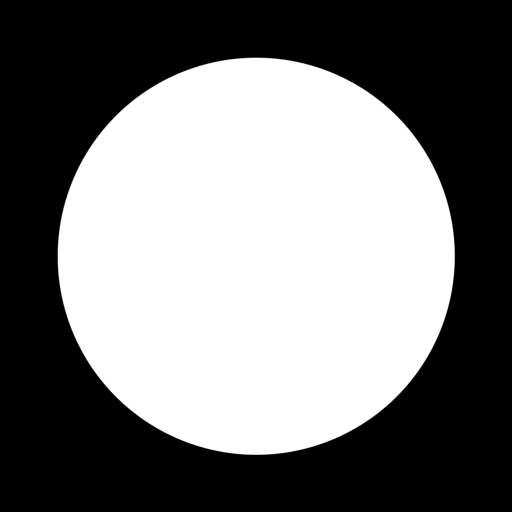

# **Flic Bluetooth for Home Assistant**



Connect supported Flic buttons directly to Home Assistant through its native
Bluetooth integration, including ESPHome Bluetooth proxies. No Flic Hub or
`flicd` daemon is required.

## Supported hardware

- Flic v2 round buttons
- Flic Duo
- Big- and small-button events on Flic Duo
- Single, double, hold, and four-direction swipe events

Legacy Flic v1 buttons are not supported. Flic v1 uses a different,
undocumented protocol and cloud-assisted pairing mechanism. Flic has sold v2
hardware for years, but older round buttons may still be v1.

## Features

- Direct encrypted pairing with Home Assistant
- Local operation without a Flic Hub or cloud service
- ESPHome Bluetooth proxy routing and failover
- Persistent BLE sessions for reliable, low-latency events
- Battery voltage reporting
- Swipe recognition without duplicate click events
- Hold recognition without a duplicate click on release

Flic Duo push-twist, fall detection, firmware updates, and HID/MIDI
configuration are not currently supported.

## Installation with HACS

This integration is intended to be installed from a tagged GitHub release
through HACS.

Until it is included in the default HACS repository list:

1. In HACS, open **Integrations**.
2. Open the menu and choose **Custom repositories**.
3. Add `https://github.com/jameskorzekwa/ha-flic-ble` as an **Integration**.
4. Install **Flic Bluetooth** and restart Home Assistant.

The Home Assistant integration domain is `flic_ble`.

## Pairing

1. Remove the target button from any Flic Hub or other controller that should
   no longer own it.
2. Hold the button for at least six seconds to enter public pairing mode.
3. In Home Assistant, go to **Settings → Devices & services → Add integration**.
4. Select **Flic Bluetooth** and follow the pairing flow.

## ESPHome Bluetooth proxy requirements

The proxy nearest each button must support active BLE connections:

```yaml
bluetooth_proxy:
  active: true
  connection_slots: 3
```

Each connected button uses an active BLE connection slot. Increase the number
of slots or distribute buttons across additional proxies when supporting more
buttons than the nearby proxy can hold.

## Events

Each button creates a Home Assistant Event entity.

Round Flic buttons and the Flic Duo big button emit:

- `single`
- `double`
- `hold`
- `swipe_left`, `swipe_right`, `swipe_up`, and `swipe_down` on Flic Duo

The Flic Duo small button uses the `small_` prefix, such as `small_single`,
`small_hold`, and `small_swipe_left`.

Event data includes the physical button, gesture, event counter, button
timestamp, queue status, and Duo acceleration vector when available.

## Protocol and attribution

The integration implements the officially published
[Flic v2 protocol specification](https://github.com/50ButtonsEach/flic2-documentation/wiki/Flic-2-Protocol-Specification)
and
[Flic Duo protocol specification](https://github.com/50ButtonsEach/flic2-documentation/wiki/Flic-Duo-Protocol-Specification).

The Chaskey packet-authentication code was translated from Shortcut Labs AB's
permissively licensed Android reference library. See `NOTICE` and
`FLIC_LICENSE.txt`.

This independent project is not affiliated with or endorsed by Shortcut Labs
AB or Flic.
